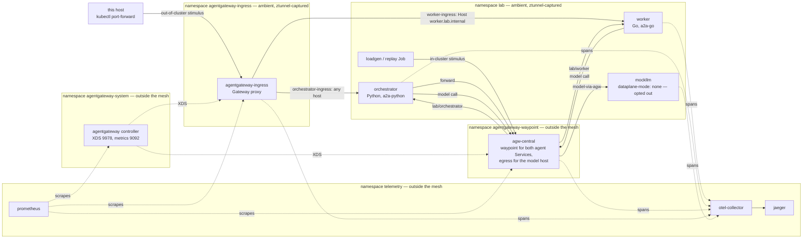

# Walkthrough — from a deleted cluster to Experiment A

This lab counts what happens to A2A agent traffic when a message is delivered more than once: two agents built on the
two official A2A SDKs, a controllable model endpoint, three ledgers that count every arrival, dispatch and model call,
and Istio Ambient with agentgateway on the path. This walkthrough builds the whole of it from a deleted cluster and
then runs six of Experiment A's rows on it, so that by the end you have counted duplicate deliveries yourself rather
than read about them; the topology it ends at is the figure below.

Everything printed here was taken from one run on 2026-09-20, 03:43:43Z to 04:10:18Z, **26 min 35 s** end to end, on
the author's machine. Timings are what that run observed; yours will differ with your machine and your network.
The whole of it is committed under `experiments/runs/2026-09-20-walkthrough/`:

```
logs/                   the unabridged stdout+stderr of every command below, one file per step, in order
timings.csv             each step's start, finish, wall time and exit status
tool-versions.txt       the host's tool versions
cluster-versions.txt    what the finished cluster reports about itself
host-sleep.txt          the host's sleep record for the run's window, and the keep-awake counts
host-sleep.sh, host-sleep-assertion-counts.py, windows.csv
                        the program that wrote host-sleep.txt, and the window it counted
reading-notes.txt       where a file of this record reads other than a reader would take it
step-1/ step-2/ step-2b/ step-2c/ step-3/   the readings each step's section quotes
a1-m1-go/               the A.1 row: summary.csv, certificates.txt, control-reset.txt, and under waypoint/ and
                        ingress/ one directory per work item holding the three ledgers and the client lines
a2-go-http-503/         the A.2 row: summary.csv, certificates.txt, control.txt, and one directory per work item
                        holding the three ledgers and the client lines
a3-baseline-go/ a3-r1-go-http/ a3-egress-go/ a3-r2-py-service/
                        one A.3 row each: summary.csv, knobs.txt, control.txt, certificates.txt,
                        cluster-versions.txt, and per work item the three ledgers, the client lines, the exported
                        trace and its attribution — the A.3 rows are the ones that collect a trace; the R1 row
                        also carries worker-span.txt, the reading its own section quotes
cleanup/                the state the run left behind
```

The findings this lab has recorded are in `findings.md`, and each demonstration below is read against the entry that
committed it, by heading. Nothing here adds a finding: this document re-takes counts that are already recorded.

Output blocks are this run's, and this is everything that is done to them. Wall-clock columns that say nothing about
the reading (`AGE`, `UPDATED`, `SERIAL NUMBER`) and a few very wide `-o wide` columns are removed for width; where
rows are left out the block says which rows it keeps or marks the gap `…`; long JSON lines are wrapped. Every quoted
`agw-central` or `ztunnel` log line loses its leading ISO timestamp, as the `ko` block in step 1 says of its own, and
three of them lose fields that are per-run or say nothing about the reading: the `ztunnel` access line in step 2
drops `src.cluster`, `dst.cluster`, `bytes_sent` and `bytes_recv`; the `ztunnel` policy-rejection line in step 2
drops `dst.cluster`, `bytes_sent`, `bytes_recv` and `duration`; and the model-leg line in step 2b drops
`http.version` and `protocol`. Nothing else is cut. The unabridged reading is always in `logs/`, under the step that
produced it.

## The topology this walkthrough ends at



Every agentic L7 hop — the A2A hops and the model calls — is carried by a proxy under agentgateway's own control
plane, and Istio does L4 only: ztunnel capture, identity and mesh-wide STRICT mTLS. That is the author's decision of
2026-09-19 in `docs/proposal-notes.md`. There are two such proxies. The **ingress** takes the out-of-cluster stimulus
and dials the receiver **pod**, on either of its two routes — `orchestrator-ingress`, which sets no hostname and so
matches everything, and `worker-ingress`, which step 2c adds for `Host: worker.lab.internal`. **`agw-central`** is
everything else: the waypoint for both agent Services, each on a hostname route of its own (`lab/worker`,
`lab/orchestrator`), and the egress for the external-looking host `model.lab.internal` on a third
(`agentgateway-waypoint/model-via-agw`). One internal listener on 8080 receives all three, and the hostname is what
tells them apart.

So an in-cluster message crosses `agw-central` on the receiving Service's route, and both agents' model calls leave
through the same proxy on the model route. The mock behind that route is deliberately outside ambient, because it
stands in for an external provider. `ztunnel` captures the pods of `lab` and `agentgateway-ingress` and nothing else
— the two subgraphs the figure marks — with the mock the one pod inside them that opts out, by the
`istio.io/dataplane-mode: none` on its own template. `agw-central`'s own namespace is not enrolled either: the proxy
terminates HBONE on 15008 itself, under its own SPIFFE identity, which is what agentgateway's Istio ambient egress
page asks for.

## Before you start

**Tools.** The README's "Prerequisites and running Experiment A" table lists every tool with the version command that
reads it; `versions.yaml` remains the source of truth for the pins the findings cite. Three rows of that table were
different on the host that produced this document, and none of them is a pin: `docker` read 29.8.0 against the table's
29.7.2, `docker buildx` v0.37.0 against v0.36.1-desktop.1, and `uv` 0.12.17 against 0.12.12. Everything this document
counts held on those. The whole reading is
[`experiments/runs/2026-09-20-walkthrough/tool-versions.txt`](../experiments/runs/2026-09-20-walkthrough/tool-versions.txt).

`istioctl` is held to the pin: `make step-2` reads `istioctl version --remote=false` and refuses anything that is not
`1.31.0`. Docker Desktop must be running before `make cluster-kind`, or kind's API server refuses connections.

**Helm.** Istio, the agentgateway control plane and the three telemetry components install by Helm and by no other
route. Without `helm` on PATH a `make` command line naming `step-2` or `step-3` — the two goals whose recipes call
helm — stops while make reads the Makefile, so no goal on that line runs. `step-2b` is not one of the two: its Helm
installs moved to step 2 on 2026-09-19, so it parses and runs without helm on PATH, and it still needs a host that
has helm, because it applies on top of step 2. One thing to know before `make step-2`: Helm's repository **cache**
can be empty while its repository list is not — on macOS, `~/Library/Caches/helm/repository` emptied by an OS
upgrade while `~/Library/Preferences/helm/repositories.yaml` still lists repositories — and then an install with
`--repo <URL>` fails on a missing index file for an unrelated repository. `helm repo update` repopulates the cache
and adds nothing.

**kind first.** Every step here runs on a two-node kind cluster. EKS enters only on one of the four triggers in
`docs/PROPOSAL.md` §5, and no overlay in `deploy/` names a cluster type.

**Your machine has to stay awake.** The longer steps run for a minute or two each and the whole walkthrough for about
twenty minutes, and a Docker Desktop VM paused by host sleep stops `ztunnel`'s certificate-renewal timer along with
everything else — a timer that, once it is late, stays late until ztunnel restarts. Nothing in this repository starts
a keep-awake or changes a power setting, and this run's scripts and commands started none: keep the machine awake
yourself. What the host's own power log holds for this run's window is counted rather than asserted, in
[`host-sleep.txt`](../experiments/runs/2026-09-20-walkthrough/host-sleep.txt), by the counting program committed
beside it: Sleep 0, Wake 0, DarkWake 0 and Maintenance 0 in the window 03:43:43Z..04:10:18Z, and of the 68
assertion lines pmset holds in that window, 17 name `caffeinate`. That file lists no assertion line; it counts
them, because such a line can carry the names of the host's own peripherals. Keep-awake is not claimed absent here:
the agent harness that ran this walkthrough holds a rolling `caffeinate` of its own, which nothing in this
repository starts or stops, and that is what those 17 lines are consistent with; whether one was held at every
moment of the window is not read from the log.

**One thing `ko` will tell you, which is not an error.** Every step target that builds images prints

```
git is in a dirty state
Please check in your pipeline what can be changing the following files:
 M README.md
?? experiments/runs/2026-09-20-walkthrough/
```

as soon as the tree holds any untracked or modified file — including the run outputs the scripts you are about to run
write into it, which is what the `??` line is (this run printed the name of its own run directory there, beside the
one committed file the branch that took this walkthrough was editing at the time). It is `ko`'s VCS stamping, and it
did not change any count here. It is not the same check as `check-go-sources-clean`, which is a prerequisite of every
step target and looks only at the Go paths the image stamp hashes (`agents/worker`, `fixtures/mockllm`, `internal`,
`go.mod`, `go.sum`); that one refuses to run at all while those paths carry uncommitted changes.

**Where the outputs go.** The experiment scripts take `RUN_ITEM`, which names a directory under `experiments/runs/`.
Every command below passes `RUN_ITEM=my-walkthrough/…`, a name **no committed record uses**: what you run is
yours, it lands in `experiments/runs/my-walkthrough/`, and it is untracked, so `git status` will show that one new
directory and — until you restore them — the two files the determinism check in step 1 overwrites, and nothing
else. The readings quoted in this document came from the same commands run under
`experiments/runs/2026-09-20-walkthrough/`, which is committed and which nothing here writes to. Do not point
`RUN_ITEM` at a dated directory under `experiments/runs/`: those hold the outputs a `findings.md` entry cites,
and a run into one overwrites the record it cites. The Cleanup section says what to do with your directory
afterwards.

The commands also take `RUN_ID`, a nonce that every work-item id carries, because pod logs outlive a run and a
repeated id would collect an earlier run's lines as if they were this run's. The nonces below are this run's, so
the work-item ids in the outputs are reproducible; change them if you run a step twice.

Run everything from the repository root, and when a step below writes a file outside the repository it takes the
directory from the environment — `"${TMPDIR:-/tmp}"` — rather than naming one.

## Step 0 — delete the cluster, then create it

```
make teardown
make cluster-kind
kubectl wait --for=condition=Ready nodes --all --timeout=180s
kubectl get nodes
```

`make teardown` took **1.6 s** and `make cluster-kind` **19.4 s**. Two nodes on `kindest/node:v1.37.0`, pinned by
digest in `kind-config.yaml`, both Ready within about fifteen seconds of creation, and ten `kube-system` pods:

```
NAME                           STATUS   ROLES           AGE   VERSION
agent-mesh-lab-control-plane   Ready    control-plane   25s   v1.37.0
agent-mesh-lab-worker          Ready    <none>          11s   v1.37.0
```

`make cluster-kind` creates the cluster and nothing else: no lab image is loaded and no namespace of this lab's exists
yet.

## Step 1 — three images, no mesh

```
make step-1
```

**66.5 s** on this run. It does three things in order. `check-go-sources-clean` refuses to go on while the hashed Go
paths carry uncommitted changes. `orchestrator-image` builds the Python agent with
`docker build --pull --no-cache --platform linux/$(go env GOARCH) -t orchestrator:dev -f
agents/orchestrator/Dockerfile agents/orchestrator` — the platform follows this host's Go toolchain, which read
`arm64` here — and loads it into kind: three stages on Amazon Linux 2023, a `FROM scratch` final image with no
shell, running as uid 65532, with the OpenTelemetry launcher as its `CMD`. Then
`kubectl kustomize deploy/step-1-nomesh | … ko apply` builds **two** Go binaries on
`gcr.io/distroless/static-debian13:nonroot` — the worker and the mock, the two the step-1 overlay carries a
`ko://` reference for — loads them, rolls the three Deployments, and stamps the two Go Deployments with the source
hash the later freshness guard reads. The other two Go binaries this lab builds, the load client and the replay
harness, are not built here: the experiment scripts pipe their Jobs through `ko apply` on every invocation, so
they are rebuilt each time they run and the first of them appears in the clean check below.

What `ko` printed, whole — the base digest it resolved for each of the two, and the digest it built and loaded for
each (timestamps removed; `ko` builds the two concurrently, so the order of these lines is not fixed):

```
Using base gcr.io/distroless/static-debian13:nonroot@sha256:e2e927ec666bae08560abb3c55d0659eceabb657f56b6782ab500a9fc7f555e3 for github.com/AhmadMasry/agent-mesh-lab/agents/worker
Using base gcr.io/distroless/static-debian13:nonroot@sha256:e2e927ec666bae08560abb3c55d0659eceabb657f56b6782ab500a9fc7f555e3 for github.com/AhmadMasry/agent-mesh-lab/fixtures/mockllm
Building github.com/AhmadMasry/agent-mesh-lab/agents/worker for linux/arm64/v8
Building github.com/AhmadMasry/agent-mesh-lab/fixtures/mockllm for linux/arm64/v8
Loading kind.local/worker-918a018b7a581926ead34dec2ba0fb83:65d43d8bfc2a1b002668fd2b4e87292b1d7b9b2f853b0351800d8a36fbbe0e49
Loading kind.local/mockllm-d7e8f9e58ff4838298fc2d1892c03051:9c0862d19cfa989297102fc00b63ce8a44cf5ccebcdd897ce48f09ba9d0576f9
```

```
kubectl -n lab get deploy,svc,pods -o wide
```

Abridged to the columns that matter here — the images `ko` and `docker` just built, and where each pod landed:

```
NAME                           READY   UP-TO-DATE   AVAILABLE   AGE   CONTAINERS     IMAGES
deployment.apps/mockllm        1/1     1            1           3s    mockllm        kind.local/mockllm-d7e8f9e5…
deployment.apps/orchestrator   1/1     1            1           3s    orchestrator   orchestrator:dev
deployment.apps/worker         1/1     1            1           3s    worker         kind.local/worker-918a018b…

NAME                   TYPE        CLUSTER-IP      PORT(S)    AGE
service/mockllm        ClusterIP   10.96.54.226    8080/TCP   3s
service/orchestrator   ClusterIP   10.96.88.62     8080/TCP   3s
service/worker         ClusterIP   10.96.123.148   8080/TCP   3s

NAME                                READY   STATUS        AGE   IP           NODE
pod/mockllm-ccf5685fc-gjd56         1/1     Running       3s    10.244.1.2   agent-mesh-lab-worker
pod/orchestrator-6c867f894d-mhdxn   1/1     Running       3s    10.244.1.5   agent-mesh-lab-worker
pod/orchestrator-6d79775d7f-wnw2h   1/1     Terminating   3s    10.244.1.3   agent-mesh-lab-worker
pod/worker-794f45564c-scbxg         1/1     Running       3s    10.244.1.4   agent-mesh-lab-worker
```

Three Deployments, three Services, no mesh, no gateway. The fourth pod is the orchestrator's first, terminating: the
overlay creates the Deployment and `orchestrator-image` then rolls it onto the image it has just loaded, so a read
taken this soon catches the old one on its way out. Full reading:
[`step-1/after-step-1.txt`](../experiments/runs/2026-09-20-walkthrough/step-1/after-step-1.txt).

### Is the model endpoint deterministic?

Every count later in this document rests on the model endpoint answering the same way twice and failing exactly when
it is told to, so that is the first thing to check.

```
experiments/gate1-mockllm-deterministic.sh
```

**14.6 s.** It sends twenty identical requests and hashes each answer, then arms a `close` at invocation count 5 and
sends six, then arms a `close` keyed to the work item `det-003` and sends two of those and two of `det-004`:

```
identical_hashes,latency_min_ms,latency_max_ms,count_injection_fired_at,lwi_injection_hits_det003,lwi_injection_hits_det004
20,200.315,209.529,5,2,0
```

Twenty identical answers; the count-keyed injection fired at request 5 and nowhere else; the work-item-keyed one fired
on both `det-003` requests and on neither `det-004` request. Read against
`## Gate 1 / mockllm / deterministic`, the four counts — `20`, `5`, `2`, `0` — are the committed ones exactly. The two
latency cells are wall-clock measurements of the mock's fixed 200 ms, not counts; the committed pair is 200.264 and
209.447 ms and both runs sit inside 200–210 ms. This run's `summary.csv`, the file quoted above, is copied to
[`step-1/mockllm-deterministic/`](../experiments/runs/2026-09-20-walkthrough/step-1/mockllm-deterministic/); its
`invocation.jsonl` is not, because the `git checkout --` below had already put the committed one back.

Two things about that script the reader meets here and nowhere else in the document.

It **writes into a committed run directory.** Its `RUN_DIR` is fixed to
`experiments/runs/2026-09-05-mockllm-deterministic/`, the directory the Gate 1 entry cites, so running it overwrites
that entry's two committed files and `git status` will say so. Put them back when you are done:

```
git checkout -- experiments/runs/2026-09-05-mockllm-deterministic/
```

And it **leaves an injection armed at the mock.** A work-item-keyed injection fires on every call for that id rather
than once — which is what `lwi_injection_hits_det003 = 2` above is measuring — so when the script returns, the mock is
still armed to close the connection on any call attributed to `det-003`. Nothing this walkthrough sends afterwards
carries that id, and every script below resets the mock before it sends anything, so it costs nothing here; the
cleanup section at the end resets it explicitly all the same.

### The first message, and the four ledgers

```
RUN_ID=wt1 RUN_ITEM=my-walkthrough/step-1/clean experiments/gate2-single-clean.sh
```

**42.9 s.** One clean `SendMessage` per receiver, with both receivers' injectors and the mock reset before each and
again after the run, so this measures the instruments rather than a failure:

```
receiver,work_item,deliveries,received,executes,tasks_created,invocations,client_result
worker,g2c-wt1-worker,1,1,1,1,1,task/TASK_STATE_COMPLETED
orchestrator,g2c-wt1-orchestrator,1,1,1,1,1,task/TASK_STATE_COMPLETED
```

`1/1/1/1/1` and `TASK_STATE_COMPLETED` on both receivers, which is what
`## Gate 2 / instruments / single clean request` records and what every rebuild since has re-counted.

Now read the ledgers for one of those work items. This is the shape everything later is counted in:

```
make ledgers LWI=g2c-wt1-worker
```

Ten lines, in the four sections `make ledgers` prints: the lab's three instruments, and beneath them the client's
own lines. Trimmed to the fields that matter, and with the section headers `make ledgers` writes to stderr kept for
orientation:

```
## ingress
{"ledger":"ingress","phase":"arrival","ts_arrival":"2026-09-20T03:45:54.329155304Z","remote":"10.244.1.8:35080",
 "method":"SendMessage","id":"f06937b3-e494-4be6-b53f-e99c3d04716c",
 "messageId":"01a0bceb-a298-7f00-a77b-1c3820c4168e","taskId":"","logical_work_item_id":"g2c-wt1-worker",
 "a2a_version":"1.0","content_type":"application/json",
 "body_sha256":"6e05bc4f62648da9362dd85a70accc6437577b4257a7d8bde87f15c44032e9ad",
 "body_len":276,"source":"worker"}
{"ledger":"ingress","phase":"response", … ,"status":200,"source":"worker"}

## execution
{"ledger":"execution","event":"received","method":"SendMessage","messageId":"01a0bceb-a298-7f00-a77b-1c3820c4168e",
 "taskId":"","logical_work_item_id":"g2c-wt1-worker","source":"worker"}
{"ledger":"execution","event":"execute","messageId":"01a0bceb-a298-7f00-a77b-1c3820c4168e",
 "taskId":"01a0bceb-a299-7445-9c83-8300e596752b","contextId":"01a0bceb-a299-74b1-9dbd-76c7d0eb8314", … }
{"ledger":"execution","event":"state", … ,"state":"TASK_STATE_SUBMITTED", … }
{"ledger":"execution","event":"state", … ,"state":"TASK_STATE_WORKING", … }
{"ledger":"execution","event":"state", … ,"state":"TASK_STATE_COMPLETED", … }
{"ledger":"execution","event":"result","method":"SendMessage", … ,"result_kind":"task",
 "state":"TASK_STATE_COMPLETED", … }

## invocation
{"ledger":"invocation","logical_work_item_id":"g2c-wt1-worker",
 "messageId":"01a0bceb-a298-7f00-a77b-1c3820c4168e","taskId":"01a0bceb-a299-7445-9c83-8300e596752b",
 "caller":"worker","body_sha256":"e973f4af…","stream":false,"injection":"none","outcome":"ok",
 "latency_ms":200.675,"source":"mockllm"}

## client
{"ledger":"client","attempt":1,"logical_work_item_id":"g2c-wt1-worker",
 "messageId":"01a0bceb-a298-7f00-a77b-1c3820c4168e","taskId":"01a0bceb-a299-7445-9c83-8300e596752b",
 "result_kind":"task","state":"TASK_STATE_COMPLETED","a2a_version":"1.0",
 "card_protocol_versions":["1.0"],"advertised_urls":["http://worker.lab.svc.cluster.local:8080"],
 "dialled_url":"http://worker.lab.svc.cluster.local:8080","source":"loadgen"}
```

What each one is for:

- **ingress** — the pre-dispatch ledger. It sits at the HTTP/JSON-RPC boundary *before* the A2A SDK sees the request,
  as middleware, so an arrival is counted even when the request is refused before dispatch. It carries the JSON-RPC
  `id`, the A2A `messageId`, the body's SHA-256 and length, the arrival time and the `A2A-Version` the caller sent —
  `1.0` here, which is the target. Two lines per request: the arrival, and the response with its status.
- **execution** — what the SDK actually did. `received` is the SDK's entry, `execute` the executor's own entry (a
  *dispatch* means the executor ran, not that the SDK accepted a request), then one `state` line per Task state and a
  `result`. The `taskId` appears first on the `execute` line, because the Task is created there.
- **invocation** — the model endpoint's own ledger, one line per call, carrying the work item and the `taskId` that
  caused it, the injection that was armed, the outcome and the latency. Here the `taskId` is exactly the one the
  `execute` line minted, so the model call is attributable to its own Task.
- **client** — not one of the three instruments: it is what the caller itself recorded, written by the load client,
  one line per attempt. `make ledgers` collects it from the Job's pod log so that a work item can be read from both
  ends at once. A caller that writes no such line — `curl`, in step 2b below — simply has no client section.

Two fields on that client line are worth separating, because one of them is not the card's. `card_protocol_versions`
is what the agent card advertised. `a2a_version` is the value the SDK put on the wire: a2a-go v2.5.0 selects a
transport by (version, binding), and on anything but an exact match it takes the first registered transport of the
same major and sends **that** transport's version, which is the constant `1.0`. So the header the receivers' ingress
ledgers record is a true record of what the SDK sent, and not evidence of the card's minor version. The last two
fields are the load client's own addressing, added on 2026-09-19: `advertised_urls` is what the card offered and
`dialled_url` is where the POST actually went. They are equal on every row of this walkthrough but the A.3 row that
sets `CLIENT_DIAL=target`.

The `logical_work_item_id` is minted by the client and joins all four: it travels in `Message.metadata`, as an
`lwi:<id>` token in the message text, and as the `X-Logical-Work-Item-Id` header on the model call. One logical work
item can become several A2A messages and several deliveries; the whole method is counting how many of each it became.

These four files are committed per work item under
[`step-1/clean/g2c-wt1-worker/`](../experiments/runs/2026-09-20-walkthrough/step-1/clean/g2c-wt1-worker/).

## Step 2 — Istio Ambient by Helm, STRICT, and the one central proxy

```
make step-2
```

**114.7 s.** Gateway API CRDs v1.6.2 from the **experimental** channel (that is where `HTTPRoute.retry` lives), then
the four Istio charts at 1.31.0 in the order the ambient Helm page installs them — `base`, `istiod` with
`istio-values.yaml`, `cni` with `profile=ambient`, `ztunnel` with `ztunnel-values.yaml` — then the two agentgateway
OCI charts at `v1.5.0` from `oci://cr.agentgateway.dev/charts`, which install that project's own control plane into
`agentgateway-system`, and then the overlay: the `lab` namespace labelled ambient, a mesh-wide STRICT
`PeerAuthentication` in `istio-system`, the Gateway `agw-central` in its own unenrolled namespace
`agentgateway-waypoint`, the worker Service bound to it, and the `worker` HTTPRoute. The three agents are restarted
last, because `ztunnel` captures a pod when it starts and these predate the label.

```
helm list -A
```

```
NAME             	NAMESPACE          	REVISION	STATUS  	CHART                   	APP VERSION
agentgateway     	agentgateway-system	1       	deployed	agentgateway-v1.5.0     	v1.5.0
agentgateway-crds	agentgateway-system	1       	deployed	agentgateway-crds-v1.5.0	v1.5.0
istio-base       	istio-system       	1       	deployed	base-1.31.0             	1.31.0
istio-cni        	istio-system       	1       	deployed	cni-1.31.0              	1.31.0
istiod           	istio-system       	1       	deployed	istiod-1.31.0           	1.31.0
ztunnel          	istio-system       	1       	deployed	ztunnel-1.31.0          	1.31.0
```

### What ztunnel sees

```
istioctl ztunnel-config workloads
```

The rows of the three namespaces this step creates or enrols:

```
NAMESPACE              POD NAME                       ADDRESS      NODE                   WAYPOINT PROTOCOL
agentgateway-system    agentgateway-864d45549-ktlm4   10.244.1.13  agent-mesh-lab-worker  None     TCP
agentgateway-waypoint  agw-central-67c797bcb-4nntf    10.244.1.17  agent-mesh-lab-worker  None     TCP
lab                    mockllm-7f9f9956cf-chz6b       10.244.1.16  agent-mesh-lab-worker  None     TCP
lab                    orchestrator-fdf47c789-n9m8c   10.244.1.15  agent-mesh-lab-worker  None     HBONE
lab                    worker-bd46d84b5-4h4hl         10.244.1.14  agent-mesh-lab-worker  None     HBONE
```

Both agents read `HBONE`: they are captured. The mock reads `TCP` because it carries
`istio.io/dataplane-mode: none` — it stands in for an external provider, so the model route's call to it is this
lab's external plaintext leg. `agw-central` reads `TCP` because its namespace is not enrolled at all: an
agentgateway proxy terminates HBONE under its own identity, and agentgateway's ambient egress page says to leave
that namespace unlabelled for exactly that reason. The controller reads `TCP` for the same reason as its own
namespace: it is infrastructure, not a traffic path.

The binding is on the **Service**, not the pod, and it takes two labels because the proxy is in another namespace:

```
kubectl -n lab get svc worker -o jsonpath='{.metadata.labels}'
```

```
{"app":"worker","istio.io/use-waypoint":"agw-central","istio.io/use-waypoint-namespace":"agentgateway-waypoint"}
```

### The certificate

```
istioctl ztunnel-config certificates --node agent-mesh-lab-worker
```

```
CERTIFICATE NAME                          TYPE  STATUS     VALID CERT  NOT AFTER             NOT BEFORE
spiffe://cluster.local/ns/lab/sa/default  Leaf  Available  true        2026-09-27T03:48:06Z  2026-09-20T03:46:06Z
spiffe://cluster.local/ns/lab/sa/default  Root  Available  true        2036-09-17T03:47:12Z  2026-09-20T03:47:12Z
```

Seven days on the leaf, by the author's decision of 2026-09-12, which takes two settings rather than one:
`pilot.env.DEFAULT_WORKLOAD_CERT_TTL` in `istio-values.yaml` and, the operative one for a ztunnel leaf,
`env.SECRET_TTL` in `ztunnel-values.yaml`. This is the check to run before any mesh run on a cluster that has been
standing: ztunnel computes each renewal deadline on a clock that does not advance while the host sleeps, so on a
laptop this reads `false` sooner than the lifetime suggests, and the remedy is
`kubectl -n istio-system rollout restart ds/ztunnel`, recorded. `make step-3` and every experiment script run it
first.

### The same message, and who carried it

```
RUN_ID=wt2 RUN_ITEM=my-walkthrough/step-2/clean experiments/gate2-single-clean.sh
```

**42.1 s**, and the identical counts — `1,1,1,1,1` and `TASK_STATE_COMPLETED` on both receivers. The ledgers do not
change when a mesh appears under them; what changes is who carried the bytes:

```
kubectl -n agentgateway-waypoint logs deploy/agw-central | grep 'http.path=/ ' | head -1
kubectl -n istio-system logs -l app=ztunnel --tail=-1 | grep 'loadgen-g2c-wt2-worker' | grep access
```

```
info request gateway=agentgateway-waypoint/agw-central listener=inner-http route=lab/worker
  endpoint=10.244.1.14:8080 src.addr=10.244.1.19:52994 src.identity=spiffe://cluster.local/ns/lab/sa/default
  http.method=POST http.host=worker.lab.svc.cluster.local http.path=/ http.version=HTTP/1.1 http.status=200
  trace.id=fd03633305ca99e7116f8e4ee02e57cd span.id=6946ee039bf96a00 protocol=http duration=209ms

info access connection complete src.addr=10.244.1.19:50210 src.workload="loadgen-g2c-wt2-worker-kt4tn"
  src.namespace="lab" src.identity="spiffe://cluster.local/ns/lab/sa/default"
  dst.addr=10.244.1.17:15008 dst.hbone_addr=10.96.123.148:8080 dst.service="worker.lab.svc.cluster.local"
  dst.workload="agw-central-67c797bcb-4nntf" dst.namespace="agentgateway-waypoint"
  dst.identity="spiffe://cluster.local/ns/agentgateway-waypoint/sa/agw-central" direction="outbound"
  duration="218ms"
```

Read the two together: `ztunnel` tunnelled the load Job's connection to **`agw-central`** on port 15008, both ends
named by SPIFFE identity and the proxy's identity its own rather than the namespace default, and the proxy then made
the L7 hop to the worker pod on route `lab/worker`. Both lines are in
[`step-2/access-logs.txt`](../experiments/runs/2026-09-20-walkthrough/step-2/access-logs.txt).

### Plaintext is refused

mTLS is enforced here, not merely available, and the test is a pod outside the mesh asking a mesh workload for its
agent card — a plain unauthenticated GET, so a refusal is the transport refusing rather than the application.

```
kubectl -n default run mtls-probe --image=curlimages/curl:8.22.0 --restart=Never --command -- sleep 300
kubectl -n default wait --for=condition=Ready pod/mtls-probe --timeout=90s
kubectl -n default exec mtls-probe -- curl -sS -o /dev/null -w 'http=%{http_code} exit=%{exitcode}\n' --retry 0 \
  --connect-timeout 5 --max-time 10 http://worker.lab.svc.cluster.local:8080/.well-known/agent-card.json
```

```
http=000 exit=56
curl: (56) Recv failure: Connection reset by peer
command terminated with exit code 56
```

The same for `orchestrator.lab.svc.cluster.local`. `ztunnel` names the policy that refused it:

```
kubectl -n istio-system logs -l app=ztunnel --tail=-1 | grep 'policy rejection' | tail -2
```

It prints two, one per receiver. The worker's, from this run:

```
error access connection complete src.addr=10.244.1.21:47646 dst.addr=10.244.1.14:8080
  dst.service="worker.lab.svc.cluster.local" dst.workload="worker-bd46d84b5-4h4hl" dst.namespace="lab"
  direction="inbound"
  error="connection closed due to policy rejection: explicitly denied by: istio-system/istio_converted_static_strict"
```

`curl` exit 56 with no status is what `## Gate 3 / both receivers / mTLS enforced` records for this probe, and what
every rebuild since has re-counted. What the line will carry and what it may not: the destination workload, the
`direction="inbound"` and the policy name are the reading, and they are always there; the **source** fields are
not. `src.workload`, `src.namespace` and `src.cluster` are ztunnel's own attribution of a pod it has to have
learned about, and on a prober created a second earlier it has not — this run printed both lines with `src.addr=`
alone and no source workload at all, where the run of 2026-09-16 printed the workload. Nothing the probe measures
depends on them. Remove the prober when you are done:

```
kubectl -n default delete pod mtls-probe
```

## Step 2b — the ingress, and the model host on `agw-central`

```
make step-2b
```

**67.9 s.** The overlay adds the ingress Gateway in its own ambient namespace `agentgateway-ingress`, its
catch-all route to the orchestrator, a `ServiceEntry`, an `AgentgatewayBackend` and an HTTPRoute for
`model.lab.internal` on `agw-central`,
both agents' `MODEL_BASE_URL` pointed at that host, and a port-level PERMISSIVE exception for the ingress pod's
metrics port 15020 (Prometheus runs outside the mesh and its scrape is plaintext into a captured pod).

```
kubectl get gateway -A
kubectl get ns -L istio.io/dataplane-mode
```

```
NAMESPACE              NAME                  CLASS         ADDRESS        PROGRAMMED
agentgateway-ingress   agentgateway-ingress  agentgateway  10.96.17.72    True
agentgateway-waypoint  agw-central           agentgateway  10.96.126.94   True

NAME                    STATUS   DATAPLANE-MODE
agentgateway-ingress    Active   ambient
agentgateway-system     Active
agentgateway-waypoint   Active
lab                     Active   ambient
…                                (default, istio-system, kube-*, local-path-storage: no label)
```

Two Gateways, one class, and only two of these namespaces are enrolled. Read that table with the diagram:
`agentgateway-system` holds the **controller** only and is not enrolled — it is infrastructure rather than the traffic
path, and two of its three clients speak plaintext to it from outside the mesh. `agentgateway-waypoint` holds
`agw-central`, and is unlabelled because agentgateway's egress page says a proxy that terminates HBONE itself must
not also be captured. The ingress **proxy** has a namespace of its own and **is** enrolled, which is what the
agentgateway ambient-ingress page asks for. Getting this last one wrong is how a from-scratch rebuild failed on
2026-09-12: with the controller captured, `ztunnel` refused Prometheus's scrape of it under STRICT and the other
proxy's XDS dial was reset, and the running cluster had hidden it because that stream predated the policy.

The step also moves both agents' model endpoint:

```
kubectl -n lab get deploy orchestrator worker -o json | jq -r '.items[] | .metadata.name + ": " +
  ([.spec.template.spec.containers[0].env[]? | select(.name=="MODEL_BASE_URL" or .name=="PUBLIC_URL") |
  "\(.name)=\(.value)"] | join(" "))'
```

```
orchestrator: MODEL_BASE_URL=http://model.lab.internal:8080/v1 PUBLIC_URL=http://agentgateway-ingress.agentgateway-ingress.svc.cluster.local
worker: MODEL_BASE_URL=http://model.lab.internal:8080/v1 PUBLIC_URL=http://worker.lab.svc.cluster.local:8080
```

### The model leg

```
RUN_ID=wt2b RUN_ITEM=my-walkthrough/step-2b/clean experiments/gate2-single-clean.sh
kubectl -n agentgateway-waypoint logs deploy/agw-central | grep chat/completions | tail -2
```

**43.5 s**, counts unchanged at `1,1,1,1,1` `TASK_STATE_COMPLETED` on both receivers, and the model call now leaves
through `agw-central` on the model route. The `grep` prints two lines, **one per work item the clean check sent, not
one per agent**: both are the worker's, from the same `src.addr`, because the orchestrator is deployed in forward
mode and the worker is the one that calls the model — which is what the out-of-cluster ledgers below show line by
line. The first is the worker's own work item:

```
info request gateway=agentgateway-waypoint/agw-central listener=inner-http
  route=agentgateway-waypoint/model-via-agw endpoint=mockllm.lab.svc.cluster.local:8080
  src.addr=10.244.1.23:57672 src.identity=spiffe://cluster.local/ns/lab/sa/default http.method=POST
  http.host=model.lab.internal http.path=/v1/chat/completions http.status=200 duration=202ms
```

The `route=` is the whole point of the topology: one proxy, one listener, and the route name is what says this was
the model leg and not an agent leg. The route carries no `retry` stanza; every route in this lab is retry-free in
its baseline state, and that is asserted rather than assumed before every measured row. The mock's own invocation
lines for the same two work items both name `caller: worker` and the `taskId` the worker's executor minted
([`step-2b/model-leg.txt`](../experiments/runs/2026-09-20-walkthrough/step-2b/model-leg.txt)).

### The out-of-cluster path, and the card lesson

Open a tunnel to the ingress and read the orchestrator's agent card from this host. `port-forward` runs in the
foreground until it is interrupted, so give it a terminal of its own — or append `&` and keep the job id to kill
afterwards — and run everything that follows in the first terminal:

```
kubectl -n agentgateway-ingress port-forward svc/agentgateway-ingress 18080:80
```

```
curl -s http://127.0.0.1:18080/.well-known/agent-card.json | jq -c '{name, supportedInterfaces}'
```

```
{"name":"orchestrator","supportedInterfaces":[{"url":"http://agentgateway-ingress.agentgateway-ingress.svc.cluster.local","protocolBinding":"JSONRPC","protocolVersion":"1.0"}]}
```

**This is the thing to know before you try to send from your laptop.** The a2a-go client resolves the card and then,
unless `CLIENT_DIAL=target` tells it otherwise, sends to the address the card advertises — and that address is an
in-cluster DNS name, which your machine cannot resolve:

```
curl -sS -o /dev/null --max-time 5 http://agentgateway-ingress.agentgateway-ingress.svc.cluster.local/
```

```
curl: (28) Resolving timed out after 5004 milliseconds
```

So the out-of-cluster send is made by hand, with `curl` and a `Host` header, which is also how the committed
out-of-cluster rows send. At this step the ingress carries one route, `orchestrator-ingress`, which sets no hostname
and so matches every host — step 2c adds `worker-ingress`, which matches `Host: worker.lab.internal` and is how the
same send reaches the other receiver. The `Host` below is therefore free; it is the value the committed rows use.
The answer is written to a scratch directory taken from the environment rather than to a named one:

```
LWI=wt2b-ingress
OUT="${TMPDIR:-/tmp}/ingress-resp.json"
curl -s -o "$OUT" -w 'http=%{http_code}\n' -X POST http://127.0.0.1:18080/ \
  -H 'Host: orchestrator.lab.internal' -H 'Content-Type: application/json' -H 'A2A-Version: 1.0' \
  -H "X-Logical-Work-Item-Id: $LWI" \
  -d "{\"jsonrpc\":\"2.0\",\"id\":\"$(uuidgen)\",\"method\":\"SendMessage\",\"params\":{\"message\":{\"messageId\":\"$(uuidgen)\",\"role\":\"ROLE_USER\",\"parts\":[{\"text\":\"lwi:$LWI hello\"}],\"metadata\":{\"logical_work_item_id\":\"$LWI\"}}}}"
```

```
http=200
```

```
jq -c '{taskId: .result.task.id, contextId: .result.task.contextId, state: .result.task.status.state}' "$OUT"
```

```
{"taskId":"88b0bc94-1789-4e36-a330-91e6270d4758","contextId":"cef6aae8-328b-40a5-8ec7-1ab8c2be003f","state":"TASK_STATE_COMPLETED"}
```

```
make ledgers LWI=wt2b-ingress OUT=experiments/runs/my-walkthrough/step-2b/ingress
```

Seventeen lines, and this is the shape a forwarded work item has. Two ingress-ledger arrivals, one at the
orchestrator carrying the `messageId` you sent and one at the worker carrying a **new** one; two execution ledgers,
each creating a Task of its own; and **one** invocation line at the mock, `caller: worker`:

| ledger | source | what it counted |
| --- | --- | --- |
| ingress | orchestrator | 1 arrival, `messageId` `81BEE3A7…`, then status 200 |
| ingress | worker | 1 arrival, `messageId` `b37e3e7c…`, then status 200 |
| execution | orchestrator | `received`, `execute` → task `88b0bc94…`, SUBMITTED/WORKING/COMPLETED, `result` |
| execution | worker | `received`, `execute` → task `01a0bcf0…`, SUBMITTED/WORKING/COMPLETED, `result` |
| invocation | mockllm | 1 call, `caller: worker`, task `01a0bcf0…` |
| client | — | none: `curl` writes no client ledger |

One work item, **two** A2A messages, **two** Tasks, **one** model call, by design — the orchestrator forwards and the
worker is the one that calls the model. The absent client ledger is not a gap, and `make ledgers` says so on stderr
rather than silently: the lab's own clients write those lines, and `curl` is not one of them. Files:
[`step-2b/ingress/`](../experiments/runs/2026-09-20-walkthrough/step-2b/ingress/). Close the port-forward when you
are done.

## Step 2c — the second Service's route, and the worker's hostname on the ingress

```
make step-2c
```

**17.9 s.** It gives the orchestrator Service its own hostname route on `agw-central` and binds the Service to it,
and gives the worker its own hostname on the ingress, so an in-cluster stimulus to either receiver crosses the
waypoint and an out-of-cluster one can reach either receiver.

```
kubectl get httproute -A
kubectl -n lab get svc -o json | jq -r '.items[] |
  "\(.metadata.name)  istio.io/use-waypoint=\(.metadata.labels["istio.io/use-waypoint"] // "-")"'
```

```
NAMESPACE              NAME                  HOSTNAMES
agentgateway-waypoint  model-via-agw         ["model.lab.internal"]
lab                    orchestrator          ["orchestrator.lab.svc.cluster.local"]
lab                    orchestrator-ingress
lab                    worker                ["worker.lab.svc.cluster.local"]
lab                    worker-ingress        ["worker.lab.internal"]

mockllm  istio.io/use-waypoint=-
orchestrator  istio.io/use-waypoint=agw-central
worker  istio.io/use-waypoint=agw-central
```

Five routes and two Gateways, and that is the whole L7 configuration of this lab. Three of the five are on
`agw-central` — the two agent Services and the model host — and two on the ingress. `retry-off` puts all four route
**sets** back (`waypoint` is `lab/worker`, `waypoint-orchestrator` is `lab/orchestrator`, `ingress` is both ingress
routes, `egress` is `model-via-agw`), which is the state every run that is not measuring a gateway retry starts and
ends in.

Until 2026-09-19 the two Services had one istiod-driven waypoint each, because a single shared istiod-driven waypoint
was measured to misroute; that reproduction and its draft issue stand as a report about that class at that version,
and the reasons the class is retired here are in `deploy/step-2c-gate2/kustomization.yaml` and in the dated notes in
`docs/proposal-notes.md`.

## Step 3 — telemetry, and one trace per work item

```
make step-3
```

**100.9 s.** It runs the certificate check first, then applies step 3's configuration through `ko` and installs the
three telemetry components from their charts into an unenrolled `telemetry` namespace. The namespace stays out of the
mesh deliberately: an in-mesh collector would enforce mTLS on inbound OTLP and refuse the spans of every emitter that
is not ztunnel-captured — the mock and `agw-central` — which is exactly the set of hops this step exists to light up.

Step 3's own configuration is two `AgentgatewayPolicy` pairs, one per Gateway: `frontend.tracing` and
`frontend.accessLog.otlp`, both pointing at the collector. Istio contributes no `Telemetry` resource at all; its
tracing configuration is the extension provider in `meshConfig`, which step 2 installed with the istiod chart.

**Never apply this overlay with a plain `kubectl apply -k deploy/step-3-stress`.** It carries the Go Deployments,
whose images are `ko://` references that only `kubectl kustomize … | ko apply` resolves; a plain `apply -k` writes the
literal `ko://` string into `deployment/worker` and `deployment/mockllm` and each gains an `InvalidImageName` pod
beside its running one. Apply a telemetry-only change by file, or run this target.

The certificate check, which is the first thing it prints:

```
== certificate check ==
CERTIFICATE NAME                                                        TYPE  STATUS     VALID CERT  NOT AFTER
spiffe://cluster.local/ns/agentgateway-ingress/sa/agentgateway-ingress  Leaf  Available  true        2026-09-27T03:50:35Z
spiffe://cluster.local/ns/lab/sa/default                                Leaf  Available  true        2026-09-27T03:48:06Z
…                                                                       Root  (both identities' Root rows)
certificate check: VALID CERT true for spiffe://cluster.local/ns/lab/sa/default; ztunnel not restarted
```

Two identities, not three: `agw-central` has a SPIFFE identity of its own but it is not a ztunnel workload, so
ztunnel holds no certificate for it.

### Send one clean message first

```
RUN_ID=wt3 RUN_ITEM=my-walkthrough/step-3/clean experiments/gate2-single-clean.sh
```

**43.3 s**, `1,1,1,1,1` `TASK_STATE_COMPLETED` on both receivers again.

Run this **before** the trace, and the reason is measured rather than stylistic. `make step-3` rolls the lab pods,
and the orchestrator's **first** forward after a restart fetches the worker's agent card, which the trace then
carries. That was taken deliberately on this run, as its own reading, after the trace below:

```
kubectl -n lab rollout restart deploy/orchestrator
kubectl -n lab rollout status deploy/orchestrator --timeout=180s
REPS=1 RECEIVERS=orchestrator RUN_ID=wt3f RUN_ITEM=my-walkthrough/step-3/trace-first-forward \
  experiments/gate3-trace-per-work-item.sh
```

```
receiver,work_item,trace_ids,spans,spans_by_service,hops_without_span,lab_work_item_on_all
orchestrator,a3t-wt3f-r1-orchestrator,2,85,agentgateway-ingress=2|agw-central=8|loadgen=3|mockllm=1|orchestrator=67|worker=4,none,no:8/85
```

**85** spans against the **81** the next section reads — `+2 agw-central`, `+1 worker`, `+1 orchestrator`, and those
four are that card fetch crossing the waypoint
([`step-3/trace-first-forward/`](../experiments/runs/2026-09-20-walkthrough/step-3/trace-first-forward/)). Every
committed count for this path was taken after a clean check on the same process, so take yours the same way.

### The trace

```
REPS=2 RUN_ID=wt3 RUN_ITEM=my-walkthrough/step-3/trace experiments/gate3-trace-per-work-item.sh
```

**116.1 s.** Four work items, two per receiver, each with its three ledgers and its exported trace:

```
receiver,work_item,trace_ids,spans,spans_by_service,hops_without_span,lab_work_item_on_all
orchestrator,a3t-wt3-r1-orchestrator,2,81,agentgateway-ingress=2|agw-central=6|loadgen=3|mockllm=1|orchestrator=66|worker=3,none,no:8/81
worker,a3t-wt3-r1-worker,2,14,agw-central=6|loadgen=3|mockllm=1|worker=4,none,no:5/14
orchestrator,a3t-wt3-r2-orchestrator,2,81,agentgateway-ingress=2|agw-central=6|loadgen=3|mockllm=1|orchestrator=66|worker=3,none,no:8/81
worker,a3t-wt3-r2-worker,2,14,agw-central=6|loadgen=3|mockllm=1|worker=4,none,no:5/14
```

```
python3 experiments/runs/2026-09-16-genai-spans/trace/dangling.py \
  experiments/runs/my-walkthrough/step-3/trace
```

```
work_item,spans,trace_ids,roots,dangling_parents
a3t-wt3-r1-orchestrator,81,2,2,0
a3t-wt3-r1-worker,14,2,2,0
a3t-wt3-r2-orchestrator,81,2,2,0
a3t-wt3-r2-worker,14,2,2,0
```

Worker **14**, orchestrator **81**, `trace_ids` 2, **2 roots**, **0 dangling parents** and `hops_without_span: none`
on all four — column for column the figures `## Experiment A / both receivers / re-run on the topology of 2026-09-19`
records for this instrument. Two traces per work item rather than one, because the client fetches the agent card and
sends the message as two separate roots.

The worker's total has not moved since the GenAI layer arrived; the orchestrator's has, once. The GenAI entry
`## Gate 3 / both receivers / GenAI and agent spans` recorded **14** and **69**, up from 12 and 66, and names its own
spans as the cause: one `loadgen invoke_agent <receiver>` and one `<receiver> chat mock` on both paths, and on the
orchestrator's one `orchestrator invoke_agent worker` besides. Those two figures were counted on the previous
topology, at a2a-python 1.1.2. The change of 2026-09-19 renamed and regrouped the proxy spans and left both totals
where they were — `## Gate 3 / both receivers / topology` says so number for number. What took the orchestrator path
from 69 to **81** is the pin a2a-python 1.1.2 → 1.1.4, which added twelve
`orchestrator … EventQueueSource._deliver_to_sink` spans. No ledger count moved at any of those steps.

The whole of a worker work item, read out of that work item's `spans.csv`:

```
python3 - <<'PY'
import csv
rows = list(csv.DictReader(open(
    "experiments/runs/my-walkthrough/step-3/trace/a3t-wt3-r1-worker/spans.csv")))
for r in sorted(rows, key=lambda r: (r["trace_id"], int(r["start_us"]))):
    print("%-24s %-44s %s" % (r["service"], r["operation"], r["http_status"]))
PY
```

```
loadgen                  invoke_agent worker
loadgen                  HTTP POST                                    200
agw-central              POST /*                                      200
agw-central              POST worker.lab.svc.cluster.local:8080       200
worker                   POST /                                       200
worker                   chat mock
worker                   HTTP POST                                    200
agw-central              POST /*                                      200
agw-central              POST mockllm.lab.svc.cluster.local:8080      200
mockllm                  POST /v1/chat/completions                    200
loadgen                  HTTP GET                                     200
agw-central              GET /*                                       200
agw-central              GET worker.lab.svc.cluster.local:8080        200
worker                   GET /.well-known/agent-card.json             200
```

The two blocks of that listing are the work item's two traces, and **which of them comes first is not fixed**:
the sort is by `trace_id`, which is a random identifier, so the four `GET` rows — the card fetch — may come
above the ten `POST` rows instead of below them. Order within a trace is start time and is fixed. This run's
listing is committed as
[`step-3/trace/worker-spans.txt`](../experiments/runs/2026-09-20-walkthrough/step-3/trace/worker-spans.txt).

Every `agw-central` row above carries a status, which is new since follow-ups 19: the trace exporter reads
agentgateway's own `http.status` attribute, so a proxy row is no longer blank. The same change added two columns to
`spans.csv`, and they are what tells one proxy's hops apart now that there is one proxy:

```
head -1 experiments/runs/my-walkthrough/step-3/trace/a3t-wt3-r1-worker/spans.csv
```

```
trace_id,span_id,parent_span_id,service,operation,start_us,duration_us,lab_work_item,lab_message_id,http_status,route,retry_attempt
```

```
python3 - <<'PY'
import csv
rows = list(csv.DictReader(open(
    "experiments/runs/my-walkthrough/step-3/trace/a3t-wt3-r1-worker/spans.csv")))
for r in sorted(rows, key=lambda r: (r["trace_id"], int(r["start_us"]))):
    if r["service"] == "agw-central" and r["route"]:
        print("%-10s %-38s %s" % (r["operation"], r["route"], r["retry_attempt"] or "-"))
PY
```

```
POST /*    lab/worker                             -
POST /*    agentgateway-waypoint/model-via-agw    -
GET /*     lab/worker                             -
```

Three `route` values on one service: the POST to the worker, the model call, and the card fetch. `route` is on the
proxy's SERVER span — the one per request it received — and `retry_attempt` is agentgateway's `retry.attempt`,
empty here because no route carries a stanza. The layer-attribution tool keys on `route` for exactly this reason
([`step-3/trace/agw-central-routes.txt`](../experiments/runs/2026-09-20-walkthrough/step-3/trace/agw-central-routes.txt)).

Every hop a work item crosses in the diagram has a span. Two of those spans are named after operations rather than
HTTP verbs, and they are the lab's agentic work as the OpenTelemetry GenAI semantic conventions name it:
`invoke_agent worker` around the A2A send, `chat mock` around the model call. Counted per operation:

```
mkdir -p experiments/runs/my-walkthrough/step-3/trace/genai
python3 experiments/runs/2026-09-16-genai-spans/genai-spans.py \
  experiments/runs/my-walkthrough/step-3/trace \
  experiments/runs/my-walkthrough/step-3/trace/genai
```

```
work_item,spans,…,chat_spans,invoke_agent_spans,…,spans_missing_required,spans_missing_expected,spans_with_agent_id
a3t-wt3-r1-orchestrator,81,…,1,2,…,0,0,0
a3t-wt3-r1-worker,14,…,1,1,…,0,0,0
…                        (the two r2 rows read identically to their r1 counterparts)
```

| receiver | service | operation | kind | spans |
| --- | --- | --- | --- | --- |
| worker | loadgen | `invoke_agent worker` | CLIENT | 1 |
| worker | worker | `chat mock` | CLIENT | 1 |
| orchestrator | loadgen | `invoke_agent orchestrator` | CLIENT | 1 |
| orchestrator | orchestrator | `invoke_agent worker` | CLIENT | 1 |
| orchestrator | worker | `chat mock` | CLIENT | 1 |

`spans_missing_required=0`, `spans_missing_expected=0`, `spans_with_agent_id=0` on all four work items, the same
roll-up the GenAI entry records.

**A GenAI span count is not a delivery count, and the difference is deliberate.** The conventions say a span "SHOULD
cover the duration of the logical operation with all retries", so one `chat` span can wrap two model calls when a
client library retries under it. The A.3 R3 row counted exactly that, in
`## Gate 3 / both receivers / GenAI and agent spans` and not re-taken here: `invocations=2` in the ledger,
`mockllm=2` spans, and **one** `chat mock` span with two children. The ledgers count deliveries; the GenAI spans count logical
operations. When the two disagree, the ledger is the ground truth and the span is the explanation.

### Prometheus and the trace backend

```
experiments/runs/2026-09-12-mtls-enforced/promq.sh targets
```

```
agentgateway-controlplane  up  http://10.244.1.13:9092/metrics
agentgateway-proxies       up  http://10.244.1.17:15020/metrics
agentgateway-proxies       up  http://10.244.1.24:15020/metrics
istiod                     up  http://10.244.1.10:15014/metrics
otel-collector             up  http://otel-collector.telemetry.svc.cluster.local:8889/metrics
ztunnel                    up  http://10.244.0.6:15020/metrics
ztunnel                    up  http://10.244.1.12:15020/metrics
-- 7/7 targets up
```

**7/7**: the two agentgateway proxies, two `ztunnel`, `istiod`, the control plane and the collector — the roster
`## Gate 3 / both receivers / topology` records and every entry since has re-counted. The earlier entries counted
9/9, with four proxies; one proxy now does what the two istiod-driven waypoints and the separate egress proxy did,
and the proxy job's selector is unchanged.

To read a trace by eye, port-forward the backend's own UI. Nothing else is installed to look at it with. This one
also holds its terminal, so give it its own as the ingress tunnel above needed:

```
kubectl -n telemetry port-forward svc/jaeger 16686:16686
# then open http://127.0.0.1:16686
```

The services the backend holds spans for, read from its stable `/api/v3` query API (Jaeger 2.21.0 removed the
legacy `/api/services` path this step used until 2026-09-19, in jaegertracing/jaeger#9260; the v3 path answers the
same list on 2.20.0 and on 2.21.0, as `{"services":[…]}`):

```
curl -s http://127.0.0.1:16686/api/v3/services | jq -r '.services[]' | sort
```

```
agentgateway-ingress
agw-central
jaeger
loadgen
mockllm
orchestrator
worker
```

Seven, where the previous topology held nine: the two istiod-driven waypoints and the separate egress proxy are gone
and `agw-central` is the one name that carries their hops.

Storage is in memory, so a restart of that pod loses every trace it holds; the traces a findings entry cites are the
exported copies under `experiments/runs/`, not the ones in the backend. To export one work item at a time:

```
make export-trace LWI=<logical_work_item_id> OUT=<dir>
```

## Experiment A, six rows

The cluster is now what the diagram draws, and the rest is Experiment A. Each row below runs at **reduced
repetitions** — the committed entries were taken at twenty per row and these at two, or one on the egress row — so
what is being demonstrated is that the counts reproduce, not that they reproduce with the committed statistical
weight. Every row resets both receivers' injectors and the mock before each repetition, arms exactly one failure,
sends exactly one stimulus, and puts back everything it changed on every exit path.

The full matrix takes hours; the six here take about nine minutes together and cover the four things the
experiment is for: what a receiver does with a duplicate, what a client retry puts back on the wire, where a
second delivery is made, and what changes when the client addresses a Service instead of the URL its card
advertises.

Every count below is read against `## Experiment A / both receivers / re-run on the topology of 2026-09-19`, the
entry that re-measured all of Experiment A on this topology at twenty repetitions per row, and against the older
entry each row was first recorded in where that adds something.

### A.1 M1 — the identical request, twice

```
MODE=M1 RECEIVER=go REPS=2 RUN_ID=wta1 RUN_ITEM=my-walkthrough/a1-m1-go experiments/gate2-a1.sh
```

**54.7 s.** Two repetitions over each of the two stimulus paths. Each repetition is one `make replay` in mode M1: one
`SendMessage` body delivered twice over a client with no retries, the second byte-identical to the first — same
JSON-RPC `id`, same A2A `messageId`, same bytes.

```
mode,receiver,path,work_item,deliveries,executes,distinct_message_ids,tasks_created,invocations,resp1,resp2,same_task,notes
M1,go,waypoint,a1-m1-go-waypoint-wta1-01,2,2,1,2,2,task/TASK_STATE_COMPLETED,task/TASK_STATE_COMPLETED,no,
M1,go,waypoint,a1-m1-go-waypoint-wta1-02,2,2,1,2,2,task/TASK_STATE_COMPLETED,task/TASK_STATE_COMPLETED,no,
M1,go,ingress,a1-m1-go-ingress-wta1-01,2,2,1,2,2,task/TASK_STATE_COMPLETED,task/TASK_STATE_COMPLETED,no,
M1,go,ingress,a1-m1-go-ingress-wta1-02,2,2,1,2,2,task/TASK_STATE_COMPLETED,task/TASK_STATE_COMPLETED,no,
```

Read against `## Gate 2 / go receiver / A.1 M1 exact transport replay` and against the re-run entry, every cell is
the committed one: two deliveries, two executor entries, **one** distinct `messageId`, **two** Tasks, **two** model
invocations, both responses `task`/`TASK_STATE_COMPLETED`, and `same_task: no` — the second answer names a different
Task from the first. Those entries counted 20 of 20 on each path and this run counted 2 of 2 on each; the values are
identical and the weight is not. The `waypoint` path is the one that changed under this row and not the count: what
it crosses is now `agw-central` on `lab/worker`, where it was an istiod-driven waypoint, and the re-run entry states
that the counts did not move with it.

So a2a-go v2.5.0 does not deduplicate an exact transport replay: it accepts the second delivery, dispatches it,
creates a second Task and calls the model again, on both paths. The specification permits that — §3.3.1 says Send
Message operations **MAY** be idempotent — and the SDK's own code says as much, minting a fresh task id for any
message that carries none. The useful part for the rows below is the negative result: neither the waypoint route nor
the ingress collapsed, dropped or altered the duplicate, so a second delivery counted at the worker later can be
attributed to whatever produced it rather than to the path it took.

### A.2 — what a client retry puts back on the wire

```
CLIENT=go LAYER=http RETRY_ON=transport+503 REPS=2 RUN_ID=wta2 \
  RUN_ITEM=my-walkthrough/a2-go-http-503 experiments/gate2-a2.sh
```

**48.2 s.** Neither SDK offers a retry, so the retry here is the lab's own and opt-in: `CLIENT_RETRIES=1` with
`CLIENT_RETRY_ON=transport+503`, switched on by this script alone, for this row alone. The failure it is asked to
retry is one `close-after-read` armed at the worker for the repetition's work item — the middleware writes the
arrival line and then takes the connection away.

```
client,layer,work_item,arrivals,messageId_reused,id_reused,body_identical,injection_fired,executes,invocations,client_result,notes
go,http,a2-go-http-503-wta2-01,2,yes,yes,yes,1,1,1,task/TASK_STATE_COMPLETED,knob=CLIENT_RETRIES=1 CLIENT_RETRY_ON=transport+503;client_lines=1;
go,http,a2-go-http-503-wta2-02,2,yes,yes,yes,1,1,1,task/TASK_STATE_COMPLETED,knob=CLIENT_RETRIES=1 CLIENT_RETRY_ON=transport+503;client_lines=1;
```

Read against `## Gate 2 / a2a-go client / A.2 retry identity`, the `transport+503` sub-row there reads
`2 yes yes yes 1 1 1 COMPLETED` in 20 of 20, and this run reads it in 2 of 2. Two arrivals at the worker's
pre-dispatch ledger with one `messageId`, one JSON-RPC `id` and one body hash between them: the second delivery is
the first one's bytes, unchanged. The mode matters, and which mode fires on this path was measured rather than assumed
— by that same entry, and not re-taken here: the default `transport` mode re-sends on a transport error only and
so never fires at all on this path, because the proxy in front of the worker turns the connection the receiver took
away into a synthesised **503** before the client can see it as a transport error. And
`client_lines=1`: an HTTP-layer retry is invisible above the transport, so the caller never learns there were two
deliveries. One arrival was refused before dispatch, which is why the row ends at one Task and one model call rather
than the two A.1 just counted for a duplicate that reaches dispatch.

### A.3 baseline — what raw failure looks like

```
RUN=baseline RECEIVER=go REPS=2 RUN_ID=wta3b RUN_ITEM=my-walkthrough/a3-baseline-go \
  experiments/gate3-matrix.sh
```

**99.0 s**, including the one-repetition dry run every matrix invocation runs first under a scratch nonce whose
directory is deleted. This row asserts its zero rather than assuming it: zero `retry:` stanzas across every
`HTTPRoute` read back from the API server, no `CLIENT_*` on any Deployment, the receiver's model-retry knob read off
the live object, and the Job rendered with all four `CLIENT_*` variables at their off values. Its injection is one
`close` at the **model endpoint**, so the failure is raw and any second delivery would be somebody's retry.

```
receiver,run,sub,work_item,deliveries,dispatched,distinct_messageIds,tasks,invocations,client_result,trace_spans,spans_by_service,second_delivery_layer,notes
go,baseline,none,a3m-baseline-go-wta3b-01,1,1,1,1,1,task/TASK_STATE_FAILED,14,agw-central=6|loadgen=3|mockllm=1|worker=4,none,client_lines=1;
go,baseline,none,a3m-baseline-go-wta3b-02,1,1,1,1,1,task/TASK_STATE_FAILED,14,agw-central=6|loadgen=3|mockllm=1|worker=4,none,client_lines=1;
```

Read against `## Gate 3 / both receivers / A.3 baseline` for the ledger counts and against the re-run entry for the
trace: `1 1 1 1 1` with `task/TASK_STATE_FAILED` and `second_delivery_layer: none`, **14** spans and
`agw-central=6|loadgen=3|mockllm=1|worker=4` — the committed values, here in 2 of 2 against those entries' 20 of 20.
One delivery, one dispatch, one Task, one model call, no second delivery anywhere: the baseline is retry-free by the
ledgers on a path that crosses one proxy twice. `second_delivery_layer: none` means there was no second delivery to
attribute, not that one could not be attributed.

Every cell of this row equals the re-run entry's, including the trace. It did not always: the 2026-09-09 entry
counted 8 spans and the follow-ups 10 currency re-run 12, and both figures are still what those entries record. The
two steps from 12 to 14 are named there — the GenAI layer of follow-ups 14 added one `loadgen invoke_agent worker`
and one `worker chat mock` — and the topology of 2026-09-19 renamed and regrouped the proxy spans without changing
how many there are.

### A.3 R1 — a client retry, and where the trace says it came from

```
RUN=R1 RECEIVER=go SUB=http REPS=2 RUN_ID=wta3r1 RUN_ITEM=my-walkthrough/a3-r1-go-http \
  experiments/gate3-matrix.sh
```

**128.6 s.** The same client knob A.2 measured, now with the trace collected and the layer derived from the ledgers
and the trace alone — no knob value reaches the derivation, so a row cannot be labelled by what it was expected to do.

Its `summary.csv`, with the fourteenth column, `notes`, lifted out below because it is a paragraph of its own:

```
receiver,run,sub,work_item,deliveries,dispatched,distinct_messageIds,tasks,invocations,client_result,trace_spans,spans_by_service,second_delivery_layer,…
go,R1,http,a3m-r1-go-http-wta3r1-01,2,1,1,1,1,task/TASK_STATE_COMPLETED,17,agw-central=8|loadgen=3|mockllm=1|worker=5,client-http,…
go,R1,http,a3m-r1-go-http-wta3r1-02,2,1,1,1,1,task/TASK_STATE_COMPLETED,17,agw-central=8|loadgen=3|mockllm=1|worker=5,client-http,…
```

Read against `## Gate 3 / both receivers / A.3 R1` and the re-run entry: `2 1 1 1 1 COMPLETED client-http` with
**17** spans, the committed values, 2 of 2 here against 20 of 20 there. The derivation's own reason, the
`layer_reason=` part of that `notes` column, opens:

```
the two worker server spans have distinct parent span ids 36238ae433dcdab9 and a6a98590e2dda4d3 that do not
converge on one proxy span / so each attempt crossed the proxy separately / client lines 1 which does not separate
the two layers because the lab's HTTP retry loops below the line the client prints / a proxy that exports nothing
leaves both parents dangling and is caught by the shared-parent rule instead because Task 2 measured the
istiod-driven waypoint (retired 2026-09-19) issuing one span id for both of its own attempts;
```

The last clause of that reason is the tool citing the measurement its rule rests on, and saying that the proxy it was
measured on is gone; the rule and the label are unchanged, which is what the re-run entry records for this cell.

Two deliveries, one dispatch, one Task, one model call — and the entry classifies that as **potentially dangerous**
rather than safe, because the one Task is an artefact of *where* this row's injection fires. R1 refuses the first
delivery before dispatch, so the retry always fires into a receiver that never started work. Had the first delivery
reached dispatch, A.1 above already counted what happens: a second Task and a second model call for one logical work
item, with the client seeing only the final answer.

One more reading on this row, and it comes from the row's **exported trace** rather than from `summary.csv`, which
carries no span attribute. The first of the two deliveries is the one the worker closed by its own injection, and
since 2026-09-19 the worker marks its own server span for it, as the mock marks its own:

```
python3 experiments/runs/2026-09-19-currency-rebuild/worker-span/worker-span-reading.py \
  experiments/runs/my-walkthrough/a3-r1-go-http/a3m-r1-go-http-wta3r1-01
```

The tool prints the worker's three server spans in start order — the card fetch, the closed delivery, the one that
was answered. The second of them, whole:

```
  service=worker scope=go.opentelemetry.io/contrib/instrumentation/net/http/otelhttp
    name=POST /
    kind=server
    status.code=Error
    status.description="injected: close-after-read"
    lab.injection=close-after-read
    http.request.method=POST
    http.response.status_code=200
    url.path=/
    lab.work_item=a3m-r1-go-http-wta3r1-01
    duration_ms=0.1 events=0 span_id=79263f16298bc820 parent=36238ae433dcdab9
```

That `parent=36238ae433dcdab9` is the first of the two span ids the `layer_reason` above names, so this is the
attempt the attribution tool counted as its own crossing. The **200** beside the `Error` is not a contradiction and
is left standing deliberately: the worker hijacks the connection away from `net/http` before anything is written,
and otelhttp v0.71.0 stamps its wrapper's default status on a hijack it cannot see, so the span carries a response
code for a delivery that got no response — the ledgers, not the span, are what say the delivery was refused. Read
against `## Gate 3 / go receiver / the worker's server span on its own injected close-after-read`, those four fields
are the committed ones. The third span, the delivery that was answered, reads `status.code=Unset`, an empty
description and no `lab.injection`. The whole reading, with the proxy's entry spans and the client's
beside it, is
[`a3-r1-go-http/worker-span.txt`](../experiments/runs/2026-09-20-walkthrough/a3-r1-go-http/worker-span.txt).

### A.3 egress — a gateway retry on the model leg

```
RUN=egress RECEIVER=go REPS=1 RUN_ID=wta3e RUN_ITEM=my-walkthrough/a3-egress-go \
  experiments/gate3-matrix.sh
```

**97.7 s**, one counted repetition after its dry run. This row switches the retry stanza on for the **model** route
alone, arms the model endpoint `http500` for the work item, and switches the stanza off again afterwards.

```
receiver,run,sub,work_item,deliveries,dispatched,distinct_messageIds,tasks,invocations,client_result,trace_spans,spans_by_service,second_delivery_layer,notes
go,egress,none,a3m-egress-go-wta3e-01,1,1,1,1,2,task/TASK_STATE_FAILED,16,agw-central=7|loadgen=3|mockllm=2|worker=4,gateway,client_lines=1;layer_reason=one call entered route agentgateway-waypoint/model-via-agw and the proxy made 2 upstream attempts under it / so the proxy re-sent it;
```

```
== restoring the egress route: removing the retry stanza ==
restored: retry stanzas across every HTTPRoute: 0
```

Read against `## Gate 3 / both receivers / egress-route retry` and the re-run entry: `1 1 1 1 2 FAILED gateway` with
**16** spans, the committed values, 1 of 1 here against 20 of 20 there. **One** delivery and **one** Task at the
receiver, but **two** model invocations: the duplicate was made below the A2A layer entirely, by the proxy on the
model route, and the receiver's ledgers cannot see it. That is the whole point of having three ledgers rather than
one — the mock counted a call the agent never made, and `agw-central=7` against the baseline's `6` is the proxy's
own extra span saying so. The Task still failed, because the second attempt met the same injection.

Read the reason beside the baseline's: it names `route agentgateway-waypoint/model-via-agw`. Since 2026-09-19 one
proxy serves the agent routes and the model route under one service name, so the attribution tool keys a proxy span's
hop on its `route` rather than on the service it came from. The label is the same one the entry recorded; what
changed is the evidence printed with it.

### A.3 R2, Python receiver, addressed to its own Service

```
RUN=R2 RECEIVER=py SUB=service REPS=2 RUN_ID=wta3s RUN_ITEM=my-walkthrough/a3-r2-py-service \
  experiments/gate3-matrix.sh
```

**135.9 s.** This is the sub-row the author's note of 2026-09-19 added, and it is the one place in this walkthrough
where `CLIENT_DIAL` is not empty. The load client still resolves the orchestrator's agent card, which advertises the
ingress, and then sends its `SendMessage` POST to the **Service** it resolved the card at instead. So the POST
crosses `lab/orchestrator` on `agw-central`, and the retry stanza goes on that route alone — the
`waypoint-orchestrator` route set — where the Python receiver's other gateway rows put it on the ingress routes.

```
receiver,run,sub,work_item,deliveries,dispatched,distinct_messageIds,tasks,invocations,client_result,trace_spans,spans_by_service,second_delivery_layer,…
py,R2,service,a3m-r2-py-service-wta3s-01,2,1,1,1,1,task/TASK_STATE_COMPLETED,75,agw-central=7|loadgen=3|mockllm=1|orchestrator=64,gateway,…
py,R2,service,a3m-r2-py-service-wta3s-02,2,1,1,1,1,task/TASK_STATE_COMPLETED,75,agw-central=7|loadgen=3|mockllm=1|orchestrator=64,gateway,…
```

```
layer_reason=route lab/orchestrator on the agw-central in front of orchestrator shows one inbound span with
2 upstream attempts / so the proxy re-sent the delivery it received;
```

Read against the re-run entry's table of the three Service-addressed rows: `2 1 1 1 1 COMPLETED gateway`, **75**
spans and `agw-central=7|loadgen=3|mockllm=1|orchestrator=64` — every cell the committed one, 2 of 2 here against
20 of 20 there. **Zero** `agentgateway-ingress` spans, which is the whole difference from the same row sent through
the ingress: that one reads 75 spans too, but as `agentgateway-ingress=3|agw-central=4|loadgen=3|mockllm=1|orchestrator=64`.
The ledgers count the same thing either way — two deliveries carrying one JSON-RPC id, one `messageId` and one body
hash, one dispatch, one Task, one model call — and what moved is which proxy and which route carried the POST.

### The six rows, together

| row | this run | the re-run entry, 20 of 20 | ledger counts |
| --- | ---: | ---: | --- |
| A.1 M1 go, both paths | 2 of 2 each | 20 of 20 each | `2 2 1 2 2` COMPLETED/COMPLETED `no` |
| A.2 go http 503 | 2 of 2 | 20 of 20 | `2 yes yes yes 1 1 1` COMPLETED |
| A.3 baseline go | 2 of 2, 14 spans | 20 of 20, 14 spans | `1 1 1 1 1` FAILED `none` |
| A.3 R1 go/http | 2 of 2, 17 spans | 20 of 20, 17 spans | `2 1 1 1 1` COMPLETED `client-http` |
| A.3 egress go | 1 of 1, 16 spans | 20 of 20, 16 spans | `1 1 1 1 2` FAILED `gateway` |
| A.3 R2 py/service | 2 of 2, 75 spans | 20 of 20, 75 spans | `2 1 1 1 1` COMPLETED `gateway` |

Every ledger count, every layer label and every span total in the six rows equals the one the entry that committed it
records. No cell differs. The three span totals that moved on the way to this topology — baseline 12 → 14, R1 15 → 17,
egress 14 → 16, and before that 8, 9 and 10 in the original 2026-09-09 entries — are accounted for in the entries
named beside each row, and this run reads the current figure in every case.

## Cleanup

Close any port-forward you opened. Then check that the cluster is in the state every run that is not measuring a
retry has to start and end in:

```
kubectl get httproute -A -o yaml | grep -c 'retry:'
```

```
0
```

```
kubectl -n lab get deploy -o json | jq -r '.items[] | .metadata.name as $n |
  ((.spec.template.spec.containers[0].env // [])[] |
  select(.name | startswith("CLIENT_") or . == "MODEL_RETRIES" or . == "MODEL_MAX_RETRIES") |
  "\($n): \(.name)=\(.value)")'
```

```
orchestrator: MODEL_MAX_RETRIES=0
```

No `CLIENT_*` on any Deployment; `MODEL_MAX_RETRIES=0` is the orchestrator's declared default and `MODEL_RETRIES` is
unset on the worker. The orchestrator's `DOWNSTREAM_A2A_URL` reads
`http://worker.lab.svc.cluster.local:8080`, which the matrix rows unset for a Python row and restore on exit — the
row above did exactly that, and this is the read that says it was put back.

Then reset the control state of the mock and both receivers. The determinism check in step 1 left a work-item-keyed
injection armed at the mock, and this is what takes it off:

```
kubectl -n lab run wt-cleanup --image=curlimages/curl:8.22.0 --restart=Never --command -- sleep 60
kubectl -n lab wait --for=condition=Ready pod/wt-cleanup --timeout=60s
for u in mockllm worker orchestrator; do
  kubectl -n lab exec wt-cleanup -- curl -s -o /dev/null -w "$u/control/reset -> %{http_code}\n" \
    -X POST http://$u.lab.svc.cluster.local:8080/control/reset
done
kubectl -n lab delete pod wt-cleanup
```

```
mockllm/control/reset -> 204
worker/control/reset -> 204
orchestrator/control/reset -> 204
```

`204` is the documented answer. And if you ran the determinism check, put its two committed files back:

```
git checkout -- experiments/runs/2026-09-05-mockllm-deterministic/
```

### What the walkthrough leaves behind

Three things, none of them removed by any command above, and none of them harmful:

- **`experiments/runs/my-walkthrough/`**, your run's own outputs — 1.7 MB on this run. It is untracked, so after the
  `git checkout --` above `git status` shows this one directory and nothing else. Keep it to read your own
  ledgers and traces, or `rm -rf experiments/runs/my-walkthrough` — nothing in this repository cites it.
- **`ingress-resp.json`** in whatever directory `"${TMPDIR:-/tmp}"` named, the answer the out-of-cluster send in
  step 2b was written to. `rm` it when you are done with it.
- **The Completed `loadgen-*` and `replay-*` Jobs in `lab`, and their pods** — one per work item sent from inside
  the cluster, so by the end of the walkthrough there are a good many: this run left **24** Jobs and 24 Completed
  pods beside the three running agents. Nothing removes them while the cluster stands, and that is deliberate:
  `make ledgers` reads the client ledger out of those pod logs, so deleting a Job costs you the client lines of
  every work item it sent. `kubectl -n lab get jobs` lists yours; the teardown below removes them with the cluster.

To delete the cluster:

```
make teardown
```

Do not run `make teardown` against a cluster you still want counts from; every other run in this repository leaves it
standing.

## What this run took

| target or script | wall time |
| --- | ---: |
| `make teardown` | 1.6 s |
| `make cluster-kind` | 19.4 s |
| `make step-1` | 66.5 s |
| `make step-2` | 114.7 s |
| `make step-2b` | 67.9 s |
| `make step-2c` | 17.9 s |
| `make step-3` | 100.9 s |
| **the seven targets together** | **388.9 s** |
| `gate1-mockllm-deterministic.sh` | 14.6 s |
| `gate2-single-clean.sh`, each of four | 42.9 / 42.1 / 43.5 / 43.3 s |
| `gate3-trace-per-work-item.sh`, `REPS=2` | 116.1 s |
| `gate3-trace-per-work-item.sh`, `REPS=1`, the first forward after a restart | 56.3 s |
| `gate2-a1.sh` M1 go, `REPS=2` | 54.7 s |
| `gate2-a2.sh` go/http 503, `REPS=2` | 48.2 s |
| `gate3-matrix.sh` baseline go, `REPS=2` | 99.0 s |
| `gate3-matrix.sh` R1 go/http, `REPS=2` | 128.6 s |
| `gate3-matrix.sh` egress go, `REPS=1` | 97.7 s |
| `gate3-matrix.sh` R2 py/service, `REPS=2` | 135.9 s |
| **first line to last, including the reads between** | **26 min 35 s** |

Every target and every script exited 0 on its first run, and none was repeated. Three minutes of that last figure
are a gap with nothing running in them: the driver that ran this walkthrough stopped after the read of the trace
backend's service list, having taken the `kill` on that read's own port-forward for the read's failure, and was
restarted from there. `logs/README.txt` says so beside the files. The per-step stamps are in
[`timings.csv`](../experiments/runs/2026-09-20-walkthrough/timings.csv), and what the cluster reports about itself —
`kubectl version`, `istioctl version`, the node image digest, the agentgateway image on each of the two proxies and
on the controller, and the nine Helm releases at their pins — is in
[`cluster-versions.txt`](../experiments/runs/2026-09-20-walkthrough/cluster-versions.txt).

## Where to go next

`findings.md` holds one entry per gate, receiver and mode or run — the numbers first and the interpretation second,
and no entry without a run; it is where the Experiment A work of this lab is read. `docs/proposal-notes.md` holds
the author's dated decisions since the proposal froze, and every one of them is in force: the topology this
walkthrough builds is the note of 2026-09-19. `docs/experiment-a-checklist.md` is the checklist that ran Experiment
A gate by gate, closed on 2026-09-19 with every box ticked, and is history rather than a work list. The rules for
anyone working in this repository are in `CLAUDE.md`, and the experiment design is `docs/PROPOSAL.md`, which is
frozen.
